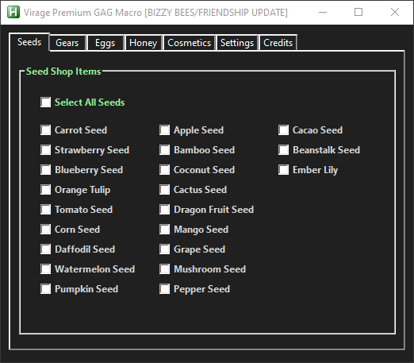
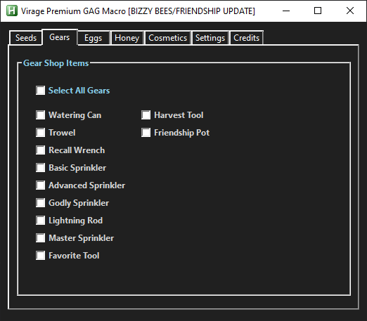
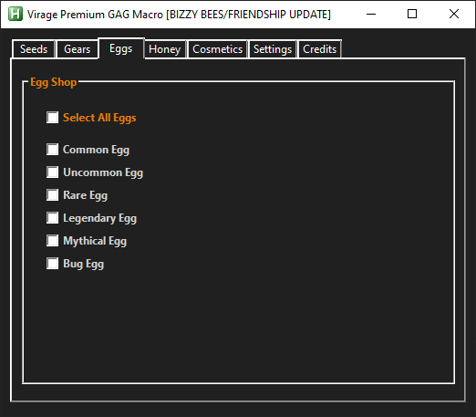
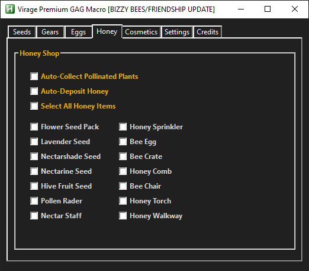
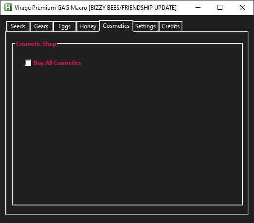
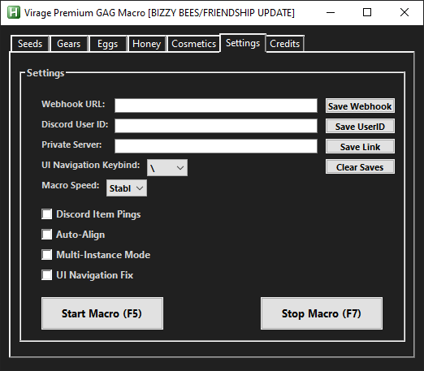
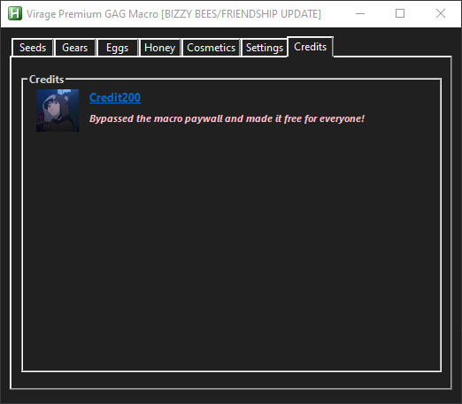

# Virage Grow A Garden Macro (Bypassed Premium)

A simple AutoHotkey script to automate farming tasks in the Roblox game “Grow a Garden.”

## Menu Preview

| Seeds                                       | Gear                                      | Eggs                                     |
| ------------------------------------------- | ----------------------------------------- | ---------------------------------------- |
|  |  |  |

| Event                                       | Cosmetic                                            | Settings                                          |
| ------------------------------------------- | --------------------------------------------------- | ------------------------------------------------- |
|  |  |  |

| Credits                                         |
| ----------------------------------------------- |
|  |

## Prerequisites

* **Running Windows**
* **AutoHotkey v1.1** installed (do **not** use v2.0):
  [https://www.autohotkey.com/](https://www.autohotkey.com/download/ahk-install.exe)

## Installation

* **With Git**

     ```bash
     git clone https://github.com/opsec-bot/Virage-Grow-A-Garden-Macro-BypassedPremium.git
     ```

  * **Or Download ZIP**

     1. Visit [https://github.com/opsec-bot/Virage-Grow-A-Garden-Macro-BypassedPremium](https://github.com/opsec-bot/Virage-Grow-A-Garden-Macro-BypassedPremium)
     2. Click **Code → Download ZIP**
     3. Extract to, for example, `C:\Scripts\VirageMacro`

## Configuration

Before you run the macro, adjust your Roblox settings and UI:

1. **Window mode**: use windowed fullscreen (not true fullscreen)
2. **Camera**: set to **Default (Classic)**
3. **Recall Wrench**: place it in your **2nd hotbar slot** (the macro expects this)
4. **Hotbar items**: have **5–10** items total
5. **UI Navigation**: turn **ON** in Roblox settings
6. **Pet**: unequip any speed-bonus pets (e.g. the “grey mouse”)

## Usage

1. Double-click the `.ahk` script to launch it.
2. Look for the green “H” icon in your system tray—your macro is active.
3. Focus the Roblox window and press **F5** (or your chosen hotkey) to start/stop.
4. To adjust delay or shop-buy options, open the script in a text editor and follow the top comments.

## Features

* **Auto-Shop Purchases**: Purchases items from shop automatically
* **Multi-alt Support**: farm on multiple accounts
* **Speed Modes**: switch between Fast and Slow
* **Discord Webhook**: send logs or alerts to your server
